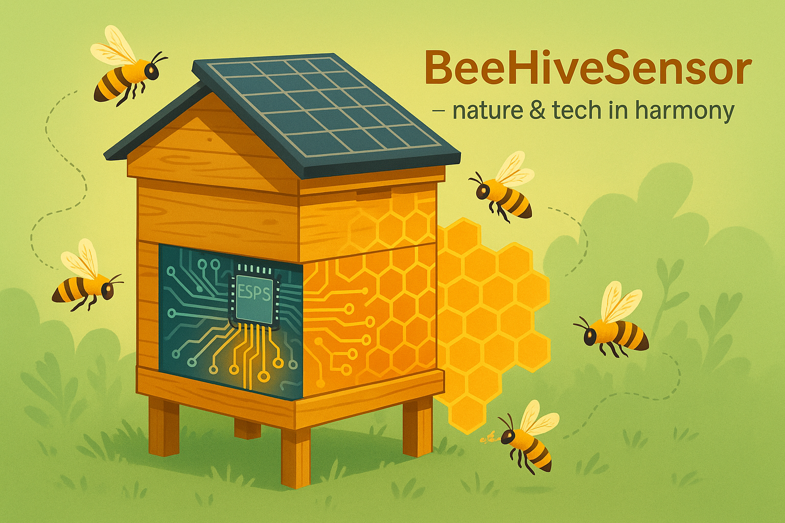

# 🐝 BeeHiveSensor – Smarte Bienenstocküberwachung

**BeeHiveSensor** ist ein Open-Source-DIY-System zur Überwachung von Bienenstöcken. Es misst Gewicht, Temperatur, Luftfeuchtigkeit und Luftdruck und überträgt die Daten per LoRa bis zu 10 km an eine Basisstation mit Display. Mit einem ESP32, Wägezellen, einem BME280-Sensor und Solarbetrieb ist es energieautark und ideal für Imker, die Nektareintrag, Schwarmaktivität oder Futterverbrauch in Echtzeit verfolgen möchten – ohne ständige Fahrten zum Bienenstand.

<p align="center">
  
</p>

---

## 🌟 Highlights

- **Präzise Messungen**: Gewicht (4x Wägezellen mit HX711), Temperatur, Luftfeuchtigkeit, Luftdruck (BME280).
- **LoRa-Funk**: Bis zu 10 km Reichweite mit 868 MHz (RFM95W).
- **Energieautark**: 5 W Solarpanel mit TP4056-Laderegler und 18650-Akku.
- **Tiefschlaf-Modus**: ESP32 verbraucht <20 µA im Sleep-Modus.
- **Einfache Firmware**: Arduino- oder PlatformIO-kompatibel, Open-Source-Bibliotheken.
- **Intuitives Dashboard**: 4,3″ TFT-Display zeigt Daten von bis zu 9 Bienenstöcken live an.

---

## 📂 Projektstruktur

```text
├── /docs           # Schaltpläne, Fotos, Verdrahtungsgrafiken
├── /firmware
│   ├── Basisstation/       # ESP32-Code für die Sensorstation
│   └── Nodes/       # ESP32-Code für die Basisstation
├── /hardware       # KiCad-PCB, 3D-Druck-STLs, Stückliste
├── LICENSE         # MIT-Lizenz
├── README.md       # Diese Datei
└── CHANGELOG.md    # Änderungsprotokoll
```

---

## ⚙️ Hardware

| Komponente                          | Funktion                           | Ressourcen |
|-------------------------------------|------------------------------------|------------|
| **ESP32 DevKit v1**                | Mikrocontroller mit WLAN, BT, Tiefschlaf | [PlatformIO Docs](https://docs.platformio.org/en/latest/platforms/espressif32.html) |
| **RFM95W (SX1276)**                | 868 MHz LoRa-Funk, bis 10 km Reichweite | [Adafruit RFM95W](https://www.adafruit.com/product/3072) |
| **HX711 + 4× 50 kg Wägezellen**    | Gewichtsmessung in 24-Bit-Genauigkeit | [Random Nerd Tutorials](https://randomnerdtutorials.com/esp32-load-cell-hx711/) |
| **BME280**                         | Temperatur (±1 °C), Luftfeuchtigkeit (±3 %), Druck (±1 hPa) | [Adafruit BME280](https://learn.adafruit.com/adafruit-bme280-humidity-barometric-pressure-temperature-sensor-breakout/overview) |
| **5 W Solarpanel + TP4056 + 18650**| Autarke Stromversorgung | [TP4056 Specs](https://www.amazon.com/Makerfocus-Charging-Lithium-Battery-Protection/dp/B071RG4YWM) |
| **4,3″ TFT-LCD + TFT_eSPI**        | Basisstation-Display | [TFT_eSPI Library](https://github.com/Bodmer/TFT_eSPI) |

👉 Detaillierte Stückliste, Schaltpläne und Gerber-Dateien in `/hardware`.

---

## 💡 Funktionen

| **Sensorstation (Node)** | **Basisstation** |
|--------------------------|------------------|
| 📏 Gewichtsmessung (10 Samples, Temperaturdrift-kompensiert) | 📊 Live-Anzeige für bis zu 9 Bienenstöcke |
| 🌡️ BME280-Daten (Temperatur, Luftfeuchtigkeit, Druck) | 📡 LoRa-Empfang mit CRC-Fehlerprüfung |
| 📡 LoRa-Datenübertragung alle 5 Minuten | 💾 Optionaler CSV-Datenlog auf SD-Karte |
| 😴 Tiefschlaf zwischen Messungen (<20 µA) | 🔔 Warnung bei niedrigem Akkustand |

---

## 🚀 Schnellstart

### 1. Repository klonen
```bash
git clone https://github.com/XythError/BeeHiveSensor.git
cd BeeHiveSensor/firmware/node
```

### 2. Entwicklungsumgebung einrichten
- **Arduino IDE**: Wähle „ESP32 Dev Module“.
// - **PlatformIO** !!COMING SOON!! : Öffne das Projekt, `platformio.ini` wird automatisch erkannt 
//([PlatformIO Docs](https://docs.platformio.org)).

### 3. Bibliotheken installieren
```bash
# HX711: https://github.com/bogde/HX711
# BME280: Adafruit_BME280
# LoRa: https://github.com/sandeepmistry/arduino-LoRa
# TFT_eSPI (nur Basis): https://github.com/Bodmer/TFT_eSPI
```

### 4. Konfiguration anpassen
Passe `config.h` an:
```cpp
#define NODE_ID          1         // Eindeutige ID pro Sensorstation
#define CAL_FACTOR       2143.0f   // Kalibrierfaktor (nach Kalibrierung)
#define TX_INTERVAL_MS   300000    // Sendeintervall (5 Minuten)
```

### 5. Flashen & Testen
- **Sensorstation**: Flashe `node/` und überprüfe Gewichtswerte im seriellen Monitor.
- **Basisstation**: Flashe `base/` und prüfe den LoRa-Empfang.
- **Feldaufbau**:
  - Montiere Wägezellen unter dem Bienenstock, HX711 in der Nähe.
  - Richte die Antenne nach außen, Solarpanel nach Süden aus.
  - Führe einen 24-Stunden-Testlauf durch und dokumentiere in `CHANGELOG.md`.

---

## 🛠️ Kalibrierung

1. Stelle den leeren Bienenstock auf die Wägezellen und führe `scale.tare()` aus.
2. Lege ein bekanntes Gewicht (z. B. 10 kg) auf und berechne den Kalibrierfaktor:  
   `Kalibrierfaktor = Rohwert / Gewicht (kg)`.
3. Trage den Faktor in `config.h` ein.  
   Details: [Random Nerd Tutorials](https://randomnerdtutorials.com/esp32-load-cell-hx711/).

---

## 📈 Roadmap

| Meilenstein                       | Status |
|-----------------------------------|--------|
| Gewicht & BME280-Messung          | ⏳ In Arbeit |
| LoRa-Datenübertragung             | ⏳ In Arbeit |
| Tiefschlaf <100 µA                | ⏳ In Arbeit |
| TFT-Dashboard                     | ⏳ In Arbeit |
| 48-Stunden-Solartest im Feld      | ⏳ In Arbeit |

👉 Aktuelle Aufgaben im [GitHub Projects Board](https://github.com/<user>/BeeHiveSensor/projects).

---

## 🤝 Mitmachen

- **Issues**: Stelle Fragen oder schlage Ideen vor.
- **Pull Requests**: Kleine, klare Änderungen sind willkommen!
- Nutze die [README-Vorlage](https://github.com/othneildrew/Best-README-Template) für Inspiration.

---

## 📜 Lizenz

[MIT-Lizenz](LICENSE) – Nutze das Projekt frei, aber verlinke dieses Repository.

---

## 🙏 Credits

- **HX711 Library**: Bogdan Necula ([GitHub](https://github.com/bogde/HX711))
- **LoRa Library**: Sandeep Mistry ([GitHub](https://github.com/sandeepmistry/arduino-LoRa))
- **Inspiration**: [Hiveeyes Community](https://community.hiveeyes.org/t/new-esp32-based-pcb-with-lora-support-from-christophe/2778)

---

**Viel Spaß beim Imkern und Bauen!** 🐝

```
